# Layerone - The Intercept 2021

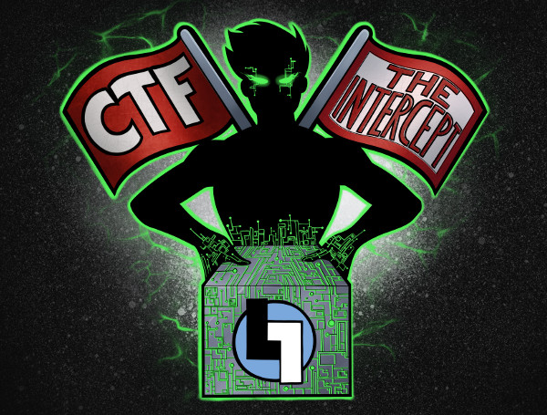


`We got some new toys here in the lab, but there’s something a bit off about them. We’ve noticed they don’t seem to be doing what the manufacturers described – could we be victims of supply chain attack? The lab monkeys are hard to understand (all that techno-mumbo-jumbo), but they’re saying the devices seem to be emitting a variety of strange signals. As always we need your help to figure things out. We’ve left the package at the arranged location. Can you intercept and decipher all the strange signals?`

#### Team never say die

For the competition, I pinged our local DEFCON group and got the following hackers to join our team : @babint_, @Tr_h, @devx00, @spiceywasabi, @SickPeaSec, @devoopes, @tensefutur3.

Most of the team was remote and we utilized a discord server to share info, although some of us met up in person to work together. 


## Qualifier Challenge

The Intercept is a hardware Capture the Flag (CTF) event focused on testing your skills in hardware hacking, anti-tamper technologies, reverse engineering, programming, and more! For 2021, LayerOne is a virtual event so the Intercept team have prepared devices to ship out to various teams to compete in the CTF. To qualify, each team needed to solve the following qualifying challenge.

#### The Problem

The challenge was presented as a zip file download, `layerone-intercept-quals.7z`. Once decompressed, you got the mp4 file `layerone-emitting-diode.mp4`. This was an approximately 25 minute long video with an animated image of a blinking LED. 

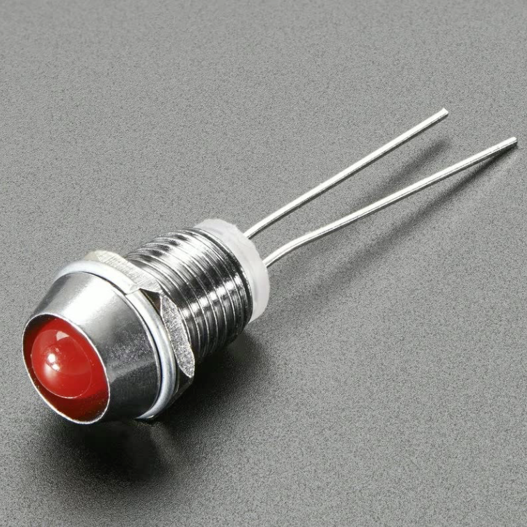

Our team started with `binwalk` and `exiftool` but didn't find any stenography present. Then, based on the premise of the Intercept, we started looking more into possible signals to decode from the presented problem. The first thought was morse code but the pattern of the blinking LED in the video didn't follow any strict morse code patterns and also seemed to have varying levels of luminance, not strictly binary ON or OFF states. 

Thinking back to stories of data ex filtration via blinking HDD activity lights, I started to dig into the possibility of the LED in the video transmitting data. @SickPea first used `ffmpeg` to start extracting individual frames from the video to analyze them individually. I took a slightly different route using a python script and `opencv` to analyze the video frame by frame, isolating a single pixel within the lens of the LED and recording it's changing color value throughout the duration of the video. The first time I ran the script, I got `51600` RGB values. The even-ness of this number stood out. I disregarded the blue and green values, only paying attention to the red. The following is an section of the values I got from the frame-by-frame analysis:
```
190
190
190
190
52
138
148
148
146
150
148
148
148
148
163
114
48
40
40
40
40
40
54
190
190
190
190
190
171
```
What immediately stood out was the most of the numbers either in the range of 40-60 or 100+. Also, there were single frames where the value would jump between the two groups of numbers (like the 52 on line 5 in the above example). This indicated to me that we were meant to be analyzing every single frame of the video on a frame-by-frame basis, and that there were two distinct groupings of numbers so it was probably binary data. 

I interpolated the red color values to 1's and 0's by setting it to 1 if the value was greater than 100, or 0 if it was less than 100, and then seperated the resulting data into 8 digit chunks, thinking that it might be binary bytes. This didn't lead to any useful data, however it let us visually see the data and patterns started to emerge. Experimenting with the size of the groups of 'bits' definite patterns started to emerge.


"Binary" data with no grouping. 

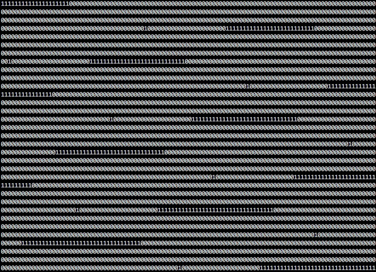


Groups of 100. 

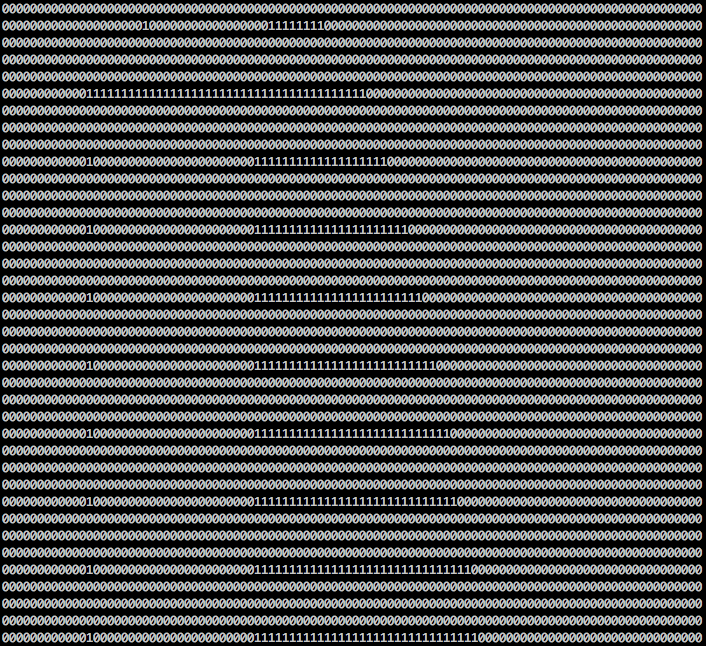

At this point I thought I might be seeing ASCII art, and @zachhanson94 confirmed that it looked like an image, so I kept at it. Eventually I saw something that looked like the LayerOne logo and I knew we were close. 
 

#### The Solve

We ended up landing on 129 rows of 400 characters each. After playing with the font size and color in the terminal, you can clearly see the LayerOne logo and with the flag `flag{s33_n0t_th4t_h4rd}` in ComicSans below. 

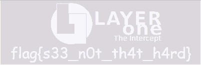

#### The Code

```python
#!/usr/bin/env python3

# importing required libraries
import cv2
import numpy as np
import sys
  
# taking the input from webcam
vid = cv2.VideoCapture('layerone-emitting-diode.mp4')

bit = ""
byte = ""
bitcount = 0

#get number of
framecount = int(vid.get(cv2.CAP_PROP_FRAME_COUNT))
  
#loop until you run out of frames
while bitcount < framecount:
  
  # capturing the current frame
  _, frame = vid.read()
  
  # displaying the current frame
  cv2.imshow("frame", frame)

  #target pixel
  target_x = 100
  target_y = 545

  #target pixel with y,x (row,column)
  target_color = frame[target_y,target_x]

  #if value is less than 100, bit is 0 else it's a 1
  if int(target_color[2]) < 100 : 
    bit = "0"
  else: 
    bit = "1"

  byte = byte + bit
  bitcount += 1

  #eperimentation led to a "byte" count of 400. really it's a line count.
  if bitcount %400 == 0:
    print(byte)
    byte =""
```

# Recon

When the boards arrived we decided as a team to follow the rules as we interpreted them and not open the box until the first day of LayerOne. Then we saw @datagram and some other teams discussing this on LayerOne's discord and we decided to at least open up the box we received and see what the 'device' looked like so we would have a more informed approach for the CTF. 

We tried to identify as components as possible and then tried to work out the traces on the board to see how things may be connected. We left everything under the epoxy alone and just speculated about those areas.

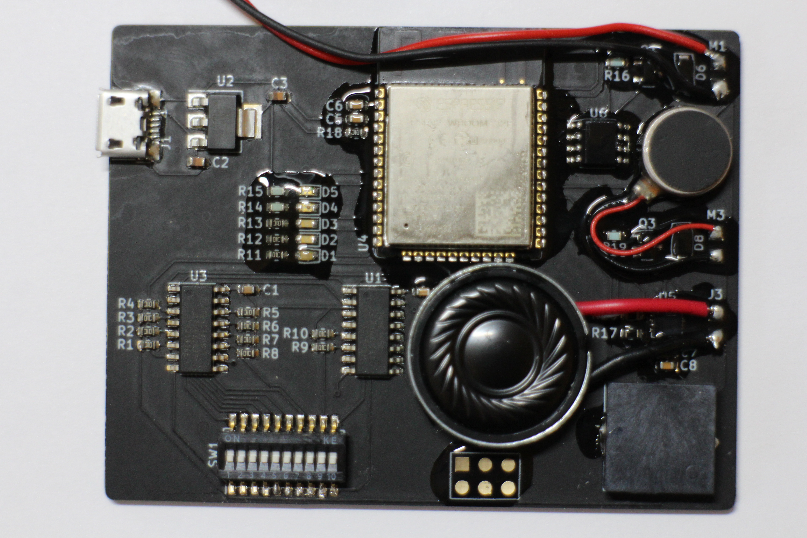

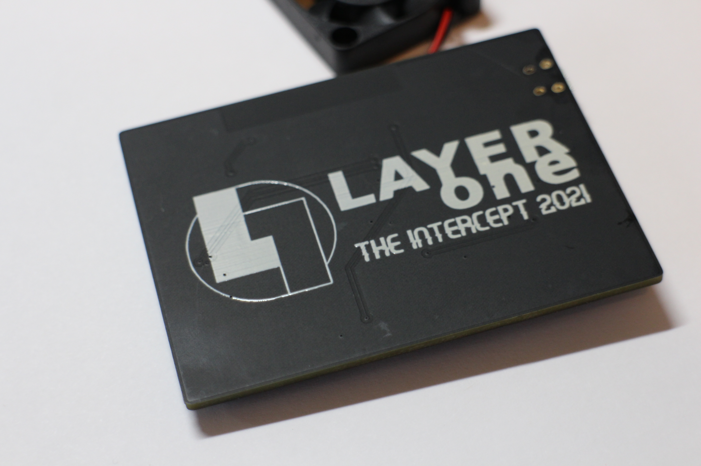

Leading up to the event I ended up designing my own version of the board in KiCad as a way to try and understand (or guess) how the components were connected to one another. 

[Best initial guess at the schematic](./schematic/schematic-v2.pdf)

This ended up being a mostly futile effort although it did solidify the understanding of a few components on the board, refreshed my KiCad skills, and yielded this cheeky gif.

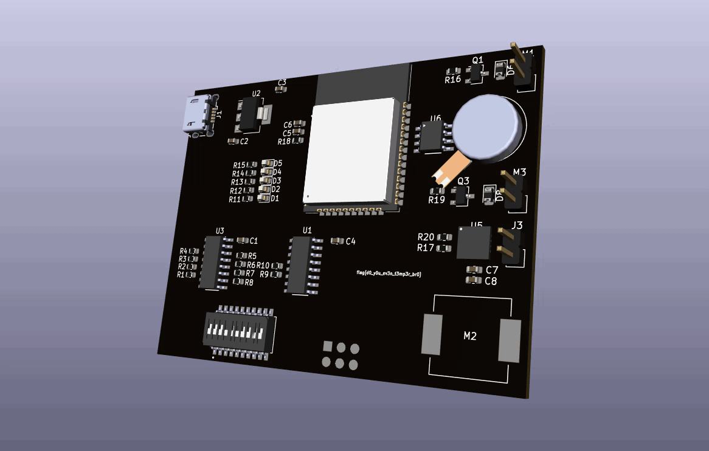


# the Main Event

Below are the challenges we solved (9 out of a possible 31).

The different challenges were activated by entering specific DIP switch combinations onto the board and then booting up the device. We used a plastic spudger from iFixit to try to be delicate with the DIP switches. It worked out well.

Most challenges were recorded through audio or video to share with the group, when nothing 'obvious' happened with the device and a particular DIP setting, we moved on and focused on the ones we thought we could handle. 

## You Art Wrong - 25 points

Manually held a wire against pin 41 on the ESP32 on reboot and got the serial output in a terminal

```Last login: Sat May 29 19:48:37 on ttys000
ets Ju��ets Jul 29 2019 12:21:46

rst:0x1 (POWERON_RESET),boot:0x16 (SPI_FAST_FLASH_BOOT)
configsip: 0, SPIWP:0xee
clk_drv:0x00,q_drv:0x00,d_drv:0x00,cs0_drv:0x00,hd_drv:0x00,wp_drv:0x00
mode:2, clock div:2
secure boot v2 enabled
secure boot verification succeeded
load:0x3fff0030 len:0x309c
load:0x40078000 len:0x528c
load:0x40080400 len:0xe84
entry 0x40080680
I (54) boot: ESP-IDF v4.4-dev-960-gcf457d412 2nd stage bootloader
I (54) boot: compile time 21:17:18
I (55) boot: chip revision: 3
I (59) boot.esp32: SPI Speed      : 40MHz
I (63) boot.esp32: SPI Mode       : DIO
I (68) boot.esp32: SPI Flash Size : 4MB
I (73) boot: Enabling RNG early entropy source...
I (78) boot: Partition Table:
I (81) boot: ## Label            Usage          Type ST Offset   Length
I (89) boot:  0 nvs              WiFi data        01 02 0000f000 00006000
I (96) boot:  1 phy_init         RF data          01 01 00015000 00001000
I (104) boot:  2 nvs_key          NVS keys         01 04 00016000 00001000
I (111) boot:  3 factory          factory app      00 00 00020000 00300000
I (119) boot: End of partition table
I (123) esp_image: segment 0: paddr=00020020 vaddr=3f400020 size=156848h (1402952) map
I (656) esp_image: segment 1: paddr=00176870 vaddr=3ffb0000 size=03b00h ( 15104) load
I (663) esp_image: segment 2: paddr=0017a378 vaddr=40080000 size=05ca0h ( 23712) load
I (673) esp_image: segment 3: paddr=00180020 vaddr=400d0020 size=7e6a0h (517792) map
I (867) esp_image: segment 4: paddr=001fe6c8 vaddr=40085ca0 size=1165ch ( 71260) load
I (897) esp_image: segment 5: paddr=0020fd2c vaddr=50000000 size=00010h (    16) load
I (898) esp_image: segment 6: paddr=0020fd44 vaddr=00000000 size=0028ch (   652)
I (903) esp_image: Verifying image signature...
I (908) secure_boot_v2: Verifying with RSA-PSS...
I (918) secure_boot_v2: Signature verified successfully!
I (932) boot: Loaded app from partition at offset 0x20000
I (932) secure_boot_v2: enabling secure boot v2...
I (933) secure_boot_v2: secure boot v2 is already enabled. Continuing..
I (940) boot: Checking flash encryption...
I (945) flash_encrypt: flash encryption is enabled (3 plaintext flashes left)
I (953) boot: Disabling RNG early entropy source...

                               .......
                          ..:::oo:::oo:::..
                        .::oo:::::::::.:.oo:.
                      .:oo::::::::::.:...:.oo:.
                    .:o:o::::::::::::.. ..:.:oo:.
                   .:oo:::::::::::::.:...:.::::oo.
                  ::oo::::::::::::::::.:.::::::oo::
                  :::::::::::::::::::::::::::::::::
o.o.o.o.o.o.o.o.o.88oooooooooooooooooooooooooooo8888.o.o.o.o.o.o.o.o.o.
..ooo..:.:.oo888''..oo..oo..oo..oo|..oo..oo..oo..oo ``oo..oo..oo..oo..o
==8888888888888888'...ooo...ooo...|ooo...ooo...ooo'8888oooo88888ooooo88
................oO8:oo..oo....oooo|....oooo..oo..::8888888888888888888-
8888888888888O''    :..oooo.......|ooooooo....ooooooooooo.
''''''''''O:.........:...ooooooooo|.........ooo'8888888888:............
     .oo8888888888888/''.....ooooo|.....ooooo'8`o             `O8888888
 .oo8888888888888888/    '........|oooooooo'88888o                `O888
o88888888888888888/'        '''...|OOOO''888888888O.                 `8
'''''''''''''''''oooooooooooooooooo'''''''''''''''''''ooooooooooooooooo
              ./8888888888888888888 You really should `\888888888888888
            ./88JJJ8W888W8888888888  not be here <_<    `\8888888888888
          ./888888J8W8W8W8888888888                       `\88888888888
         /888888J8J8W8W8W8888888888 use at your own risk:   \8888888888
       ./8888888JJJ88W8W88888888888  flag{ep0xy_B3_d4mn3d}   `\88888888
      /8888888888888888888888888888                            `\888888


```


## An Encoding More So Than A Challenge - 50 points

Morse code played out of the piezo buzzer at around 5 WPM. I was able to decode this by ear as I've been learning morse code recently. 

[An Encoding More So Than a Challenge](./audio/anencodingmoresothanachallenge.mp3)

This is what was decoded:
`flag is s4mu3l is my h0m3b0y`

## Silky Smooth - 50 points

This was the only extremely obvious flag, and the only one that we discovered during our light recon phase. 

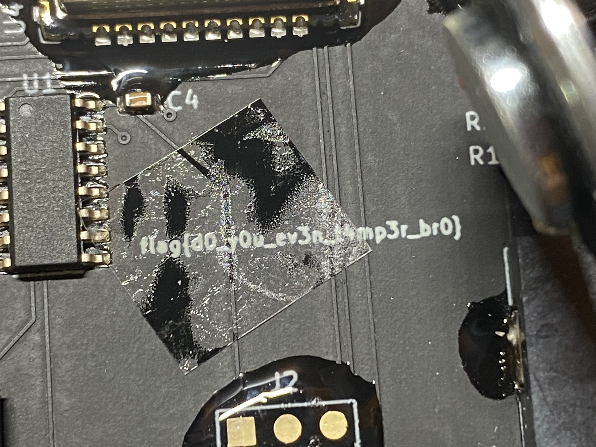

`flag{d0_y0u_ev3n_t4mp3r_br0}`


## Throw That Phone Outta My Office - 200 points

Solved by @tensefutur3

DTMF TONES

Step 1:
Record audio on shitty speaker with phone mic.

Step 2:
Bandpass filter for DTMF tone frequency range.
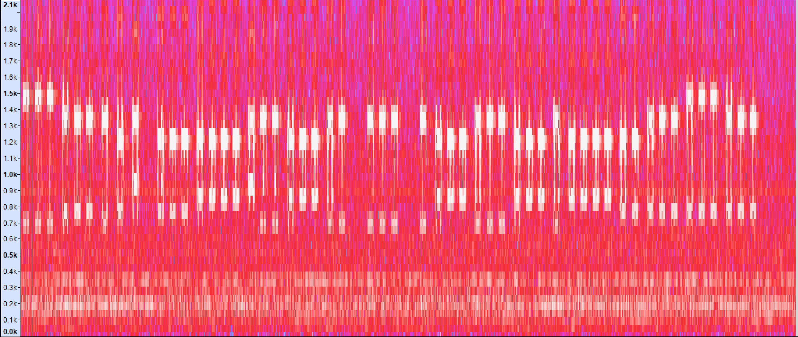

Step 3:
Decode by hand! I'm pretty sure it would have taken me longer to install an app to do the decoding automatically. Encoding is T9 texting like we millenials used to do in the 00's.
Ref: http://www.polar-electric.com/DTMF/Index.html
`333555240 444777702277722 222 27772227772777744555666555`
`flag+     is+brb          c   arcrashlol`

Step 3a:
Somehow know to ignore the `is+` as part of the flag.

Step 4:
Realize that the message is repeated three times halfway through hand-decoding the second repetition.

Step 5:
Submit flag as `brbcarcrashlol`

Step 6:
Spend way more time trying to figure out what the reference is. Maybe a meme?


## A Challenge More So Than An Encoding - 200 points

Another morse code challenge, although this one was sped up quite a bit.

After recording the audio, slow it down in Audacity and decode by ear.

[A Challenge More So Than An Encoding](./audio/AChallengeMoreSoThanAnEncoding_take2.mp3)

**Reference:** [Includes quote from Pulp Fiction]
The path of the righteous man is beset on all sides by the inequities of the selfish and the tyranny of evil men - lessed is he who in the name of charity and good will shepherds the weak through the valley of the darkness  or he is...


Flag is : `pr3ttyple4s3withsug4ront0p`

## CQD DE MGY - 250 points

Solved by @babint_

#### Musings
- CQ: https://en.wikipedia.org/wiki/CQ_(call)
- PSK31: https://en.wikipedia.org/wiki/PSK31 (sorta sounds like this)

#### CQ PSK31
iOS app decoded it. 

##### WAIT WAT DOESN'T WORK?
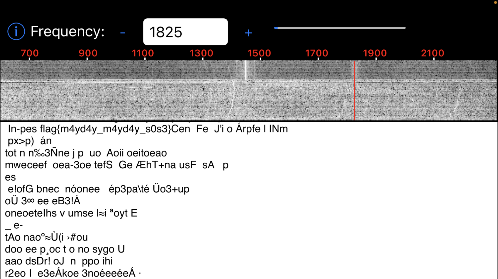
Flag does not work

##### AGAIN
Opened the file in audacity instead of playing it directly in discord. 
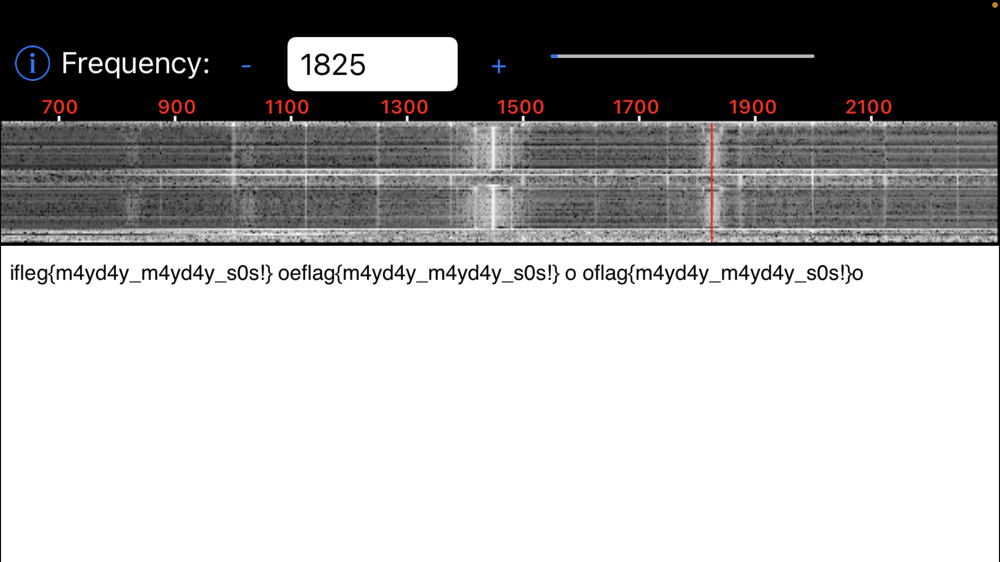

#### Flag
`flag{m4yd4y_m4yd4y_s0s!}`


## I'm Your Biggest Fan - 300 points

Identified fan control pin on ESP32 and soldered a lead to it, then hooked that up to a logic analyzer. 

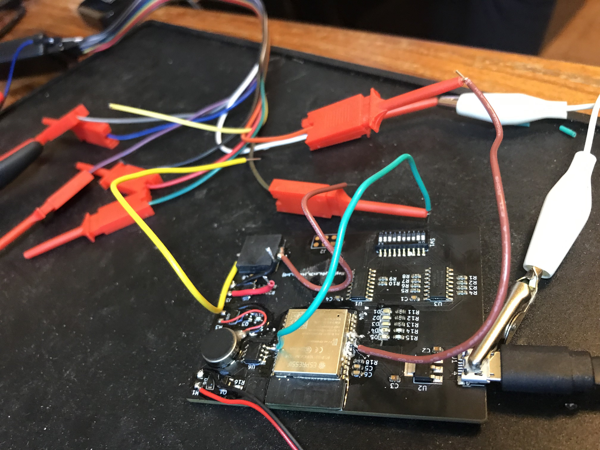


From there I manually translated to the 1's and 0's. @babint_ helped out by suggesting to look for the binary versions of the letters we anticipated to find (f, l, a, g) and this helped narrow down if the high and low signals were 1's and 0's or vice-versa.

Binary
```    
01100110011011000110000101100111011110110100001001001001010101000101001101011111001100010110111001011111001101110110100001100101010111110111011100110001011011100110010001111101
```

To ASCII
```
flag{BITS_1n_7he_w1nd}
```

## Where You From? - 300 points

[Audio sample](./audio/whereyoufrom.mp3) that sounds like numbers repeating. Zip codes?

Hint mentions this album : https://www.youtube.com/watch?v=JcsTVo4bUnA

The song "Guilty By Affiliation" has the line "Where you from?" like the challenge title.


Definitely long list of zip codes. Repeats around 5 minutes after count from sesame street laughing.

#### Zip Codes
Each zip code is equivalent to a letter. Substitution style cipher.
<details><summary>view zip code</summary>
<p>Zip codes:
90504
90250
90245
0
92334
90301
90701
91203
0
90306
90406
0
91203
90701
91323
91203
90222
90701
91106
90306
90504
90701
90301
92363
92334
90504
90250
90245
91323
90701
90504
90306
92363
91323
0
90504
90250
90245
0
92334
92363
90301
90301
92363
91791
90306
91323
91203
0
90240
90306
91106
0
90222
92363
90240
90245
0
90306
90406
0
90504
90250
90277
90245
90245
0
92334
90306
91409
90245
0
90406
90245
91409
90245
91323</p>
</details>

...

Substituted:
```
ABC DEFG HI GFJGKFLHAFEMDABCJFAHMJ ABC DMEEMNHJG OHL KMOC HI ABPCC DHQC ICQCJ
```

Solved via quip quip:
```
THE FLAG IS GANGCAPITALOFTHENATION THE FOLLOWING DIP CODE IS THREE FIVE SEVEN
```

This gave us a flag as well as the dip code for the following challenge.


## Who Doesn't Like Counting? - 300 points

#### Pre-work Solve "Where You From"
- solving gave us '357' which translate to 0101100101 and unlocks this challenge. DIP was not given to us in CTFd

#### Solving

Listening and transcribing [the audio](./audio/whodoesntlikecounting_complete_170kps.mp3) gave us this

```
023456789023456789012345789
023456789123456789012356789
023456789123456789023456789
012456789013456789
023456789123456789013456789
023456789123456789012345679
012345678012345689
023456789123456789012456789
012456789013456789
023456789123456789012346789
023456789023456789012346789
012456789013456789
023456789123456789013456789
023456789123456789012345679
012345678012345689
023456789123456789012456789
023456789013456789012456789
012345678012345678
012356789012345679
023456789023456789012345689
023456789023456789123456789
023456789023456789012345789
023456789123456789012346789
023456789023456789123456789
023456789123456789012456789
012345678012346789
023456789123456789012346789
012346789012456789
012345678012346789
023456789123456789013456789
023456789023456789012345689
012345689012345679
023456789013456789012346789
```

missing digits from the above sets of numbers (if you are expecting to loop through 0-9 each time)

```
116
104
101
32
102
108
97
103
32
105
115
32
102
108
97
103
123
99
48
117
110
116
105
110
103
95
105
53
95
102
117
78
125
```

to ascii

```
t h e   f l a g   i s   f l a g { c 0 u n t i n g _ i 5 _ f u N }
flag{c0unting_i5_fuN}
```

# FAILS

There were a handful of challenges we made decent headway on but didn't solve

## The Point I'm Making With John Lennon - 150

We couldn't get a clean enough audio signal to decode the SSTV image. 

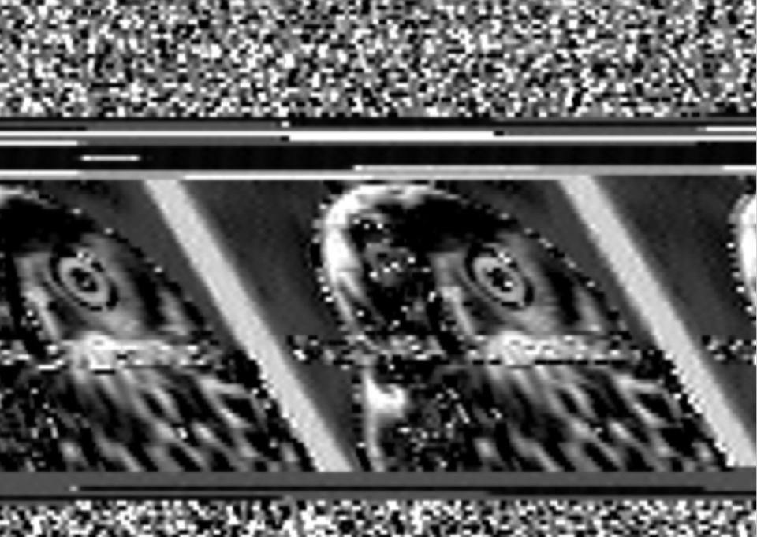

## Baudacious Beats - 150 points

We translated [the audio](./audio/baud_beats_take2.mp3) to binary, and tried decoding it as Baudot-Murray Teletype code, but couldn't quite make sense of it.

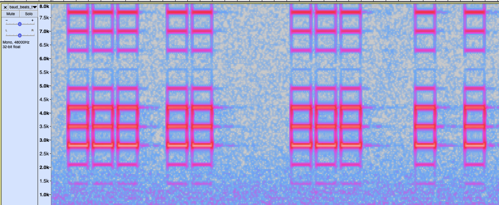

Code to convert to binary
----

```python
#!/usr/bin/env python3
import math
import wave

# filename of audio wav file
filename = 'baudacious_beats.wav'

# width of a 1 or 0 in number of frames
tone_width = 3800

# separator to skip over space in between bits
separator_width = 950

# Offset to ignore sound at beginning of file
offset = 489715

zero_char = "0"
one_char = "1"


def avg(vals):
    return sum(vals)/len(vals)


def decode_ints(frames):
    next_set = [int.from_bytes(frames[x:x+2], 'little') for x in range(0, len(frames), 2)]
    for i in range(len(next_set)):
        if next_set[i] < 1000 or next_set[i] > 64000:
            next_set[i] = 0
    return next_set


def get_binary(dat):
    vals = []

    next_set = dat.readframes(tone_width)
    while len(next_set) > 1000:
        next_set = decode_ints(next_set)
        vals.append(one_char if avg(next_set) > 1000 else zero_char)
        _ = dat.readframes(separator_width)
        next_set = dat.readframes(tone_width)

    return "".join(vals)

def print_lines(string, num_lines=4):
    per_line = math.ceil(len(string)/num_lines)
    for line in range(num_lines):
        print(string[line * per_line:line*per_line + per_line])

if __name__ == "__main__":
    dat = wave.open(filename, 'rb')
    _ = dat.readframes(offset)
    print_lines(get_binary(dat))
```

Binary Output
---

#### Attempt 1 (missings some data)
```binary
1110110001110010100100000010001110001101111101101100111110000001101100110101110010100000010010001001011001111010000001001100000110110111111000001100011100001111111110010011010100010011000010010100000010110000110010110010011011111101111000001101100110111110111110100000010011000001001001110000100000001010011110001001110111101101111110011111100011011101100011001101101110100111110000100100101100110000110100100010011000001110001110001101111100001111001100010111110010101000100000100101110000000100100010010001101111110001111000110111111001111110001100001110001101010100000010000001001011100000110001000011110000000110001101111000111111011110011100001101101100110001001111101100001001100111000001100011011000001101111101110011111011110001101100101010001111100010100010010110110000000100101100000101000011011110001111110111100111000111111011001100010011111011000010011001110000011000110110000010010111011100111110111100011011011111100011111000101000100101101100000001001011000001010000100001010011000111011000111110000011011111001110000111100100100001010001111001001000011111100011100010100110011100011001101100111111111000001100101010001111100000101001000011001000010110000001001111000111000111110110110000011011111000001100000010010101100001100101110100001000110011011101001111110011001101101100011101101111111111111111111000010111011010010001011111110000011010010001001001000011101100011111000001101111100111000011110010010001100001001010000011010011001000100001010110010110001100011111110110111011001111111000011011010000100110111111011111101011000011000001001010110000111000011111111111011001111111111010111001010000001001000000100011001000110111000101010010010111000111111100110111111001111110011010001001011001001110000101111011111101111100001001011101110000111111111111110110111101111111110000111110101010011110001110010010110111110111111000011010011011111011011011011100000000000000
```

#### Attempt 2
```
1110110001110010100100000010001110001101111101101100111110000001101100110101110010100000010010001001011001111010000001001100000110110111111000001100011100001111111110010011010100010011000010010100000010110000110010110010011011111101111000001101100110111110111110100000010011000001001001110000100000001010011110001001110111101101111110011111100011011101100011001101101110100111110000100100101100110000110100100010011000001110001110001101111100001111001100010111110010101000100000100101110000000100100010010001101111110001111000110111111001111110001100001110001101010100000010000001001011100000110001000011110000000110001101111000111111011110011100001101101100110001001111101100001001100111000001100011011000001101111101110011111011110001101100101010001111100010100010010110110000000100101100000101000011011110001111110111100111000111111011001100010011111011000010011001110000011000110110000010010111011100111110111100011011011111100011111000101000100101101100000001001011000001010000100001010011000111011000111110000011011111001110000111100100100001010001111001001000011111100011100010100110011100011001101100111111111000001100101010001111100000101001000011001000010110000001001111000111000111110110110000011011111000001100000010010101100001100101110100001000110011011101001111110011001101101100011101101111111111111111111000010111011010010001011111110000011010010001001001000011101100011111000001101111100111000011110010010001100001001010000011010011001000100001010110010110001100011111110110111011001111111000011011010000100110111111011111101011000011000001001010110000111000011111111111011001111111111010111001010000001001000000100011001000110111000101010010010111000111111100110111111001111110011010001001011001001110000101111011111101111100001001011101110000111111111111110110111101111111110000111110101010011110001110010010110111110111111000011010011011111011011011011100000000000000
```

## Code Red - 150 points

I believe this to be the same challenge as the qualifier. I probably should've just recorded a video and analyzed it, but I ended up trying to read values by hooking up a lead from the red led control pin to an arduino and reading it's analog values. I got something that resembled some sort of ASCII art pattern, but never the flag.

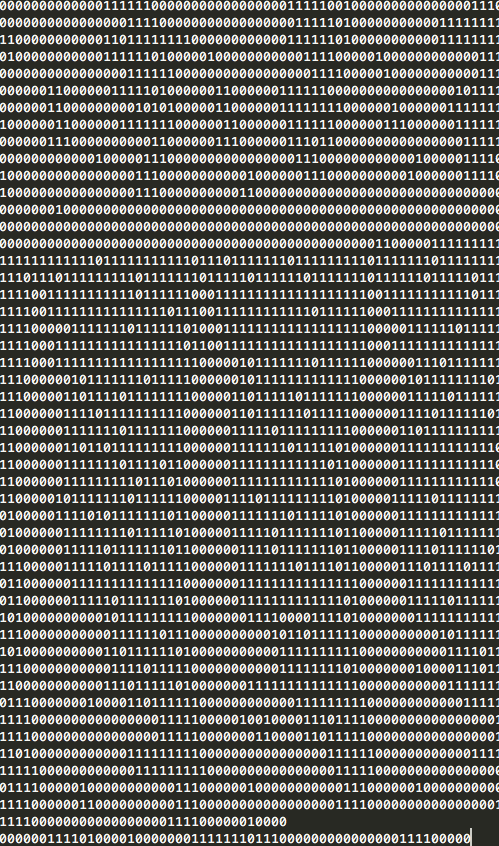

## Reach Out and Touch Faith - 275 points

The red, green, and blue led's on the board flash in different sequences. We translated these to 3 digit binary values that led nowhere. 

## Afterthoughts

Big thanks to @jrozner, @datagram and @jk for putting this CTF together. This was a great challenge and we as a team had a lot of fun (and frustration) trying to solve it. We ended up learning about tools and methods we could've used to do better from other teams while debriefing the challenge on LayerOne's discord. Looking forward to the Intercept 2022!

### Lessons Learned

- Organization is key. Our team didn't have a solid information platform at first. We had information spread across multiple discord channels and google documents. @devx00 spun up a [CTFNote](https://github.com/TFNS/CTFNote) server and this was a gamechanger. It is purpose built for collaborative note sharing for these style of CTFs. Many members of our team hadn't heard of this before and were impressed with how well it worked.
- Don't be afraid to remove the epoxy! We had tried probing different pads on the circuit board by setting up some seriously janky helping hands rigs that barely functioned. It took us a full 24 hours of the CTF before we even attempted to remove some of the epoxy on the board. In retrospect we should've done this earlier so we could've soldered wire leads to the different components we wanted to analyze signals from.
- Leading zeros. There were multiple challenges where we were presented with binary data that had either too many or too few leading zeros. This was probably a byproduct of our techniques, but either way it's worth it to try adding or removing a zero from your binary data to see if that turns junk data into flags.
- Priorities / time management. With our team collaborating remotely, but only having one physical device. We needed to focus on gathering a lot of data at the beginning of the CTF so we could have a solid chunk of challenges that remote participants could try and solve while the in-person participants could work on challenges that required physical access to the device. 
 
[LayerOne](https://www.layerone.org/)
